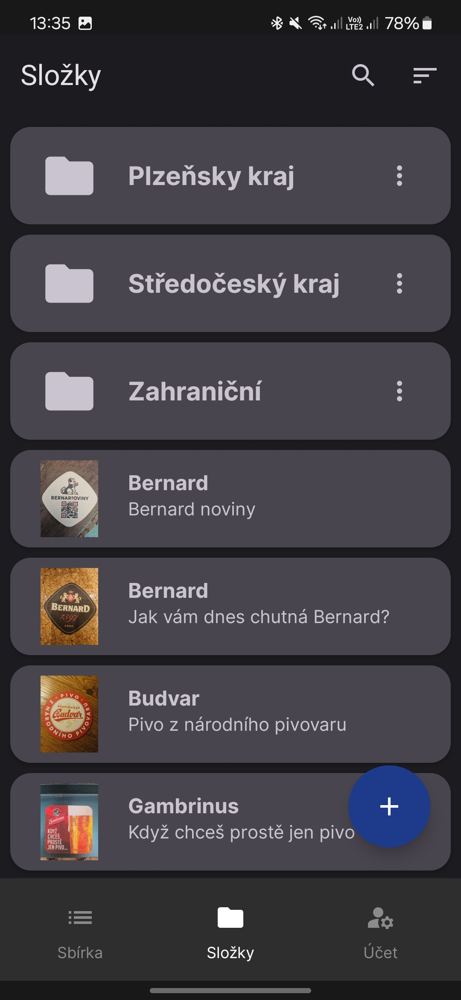
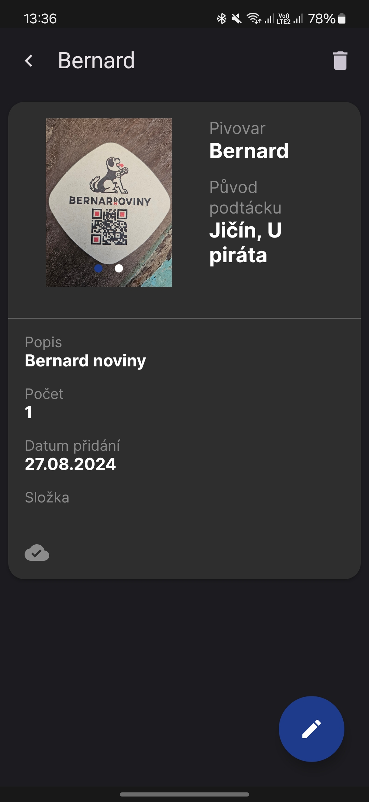

# Podtácky

This is an app made for beer coaster collectors who want to keep track of their collection.

It is a database where you can see all your coasters, add new ones, delete old ones or edit information about those already in the database. 
The app allows you to add pictures of each coaster - one of each side. 
Combined with the option to search through the database, these pictures will help you to easily tell whether you already have a given coaster or not.

The app also allows users to log in with their Google account which enables automatic backups of their collections to the cloud. These backups can then be easily restored to get the collection into a new device - all information including the photos will be automatically loaded by signing into the same account.

For czech speaking users, there is a manual available [here](https://github.com/tonda2/Podtacky/blob/master/navod.pdf).

The app can be downloaded from Google play

### Used libraries
- Androidx
- Coil
- Koin
- Room
- Zoomable
- Firebase
  
... and more

### Main features
- Main list screen, where you can see all your coasters, scroll through them and sort based on different fields
- Search by brewery and description
- Add new coasters, their information and photos
- Edit coasters
- Automatic backup of data to Firebase storage (all data is kept locally as well)

### Screenshots

      
  
